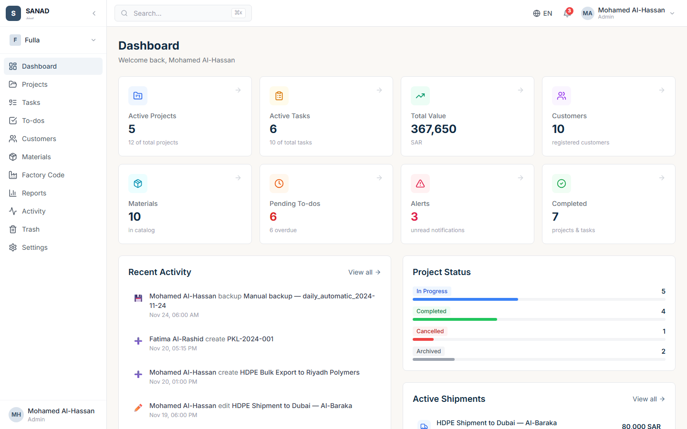

<div align="center">

# SANAD

**Enterprise export & shipping operations platform**

Arabic RTL + English LTR | Supabase Backend | Vercel Deployment | 122 E2E Tests

[](https://github.com/ahmedibm9-cyber/Sanad/actions/workflows/ci.yml)
[](https://opensource.org/licenses/MIT)
[](https://www.typescriptlang.org/)
[](https://react.dev/)
[](https://playwright.dev/)
[](https://app-wine-three-38.vercel.app)

</div>

---

## Overview

SANAD is a self-hosted web application designed for export and shipping operations. It provides multi-company support, bilingual Arabic/English interface with full RTL compatibility, role-based access control, and a complete document lifecycle engine.

**Live:** [app-wine-three-38.vercel.app](https://app-wine-three-38.vercel.app)

## Screenshots

<div align="center">
  
  <br />
  <em>Dashboard with real-time stats, to-dos, recent activity, and project status</em>
</div>

## Features

| Module | Capabilities |
|---|---|
| **Dashboard** | Welcome overview, stat cards, recent documents, activity feed, project status |
| **Projects** | Full CRUD, status tracking (In Progress / Completed / Cancelled / Archived), search, pagination |
| **Tasks** | Create, assign, track tasks with status filters and project linking |
| **To-dos** | Personal task management with priority levels, completion toggle, filters |
| **Customers** | Customer directory with detail pages, project history, contact info |
| **Materials Library** | Material catalog with grade, manufacturer, specifications |
| **Factory Code** | Factory code database with search, import/export |
| **Documents** | 7 document types (Quotation, Proforma Invoice, Tax Invoice, Commercial Invoice, Packing List, Delivery Note, Bill of Lading) |
| **Reports** | Analytics by status, date, customer, tasks, overdue, documents, user activity |
| **Activity & Audit** | Full audit trail with action type filters and expandable event details |
| **Trash & Restore** | Soft delete with restore confirmation and entity type filters |
| **Users & Permissions** | 81 granular permissions across 14 groups, role-based access control |
| **Settings** | Company identity, legal, banking, document defaults, notifications, backup, licensing |
| **Language Switching** | Full Arabic RTL / English LTR with instant toggle |
| **Global Search** | Command palette (⌘K) with cross-module search |

## Tech Stack

| Layer | Technology |
|---|---|
| **Frontend** | React 18, TypeScript 5.5, Vite 5, Tailwind CSS 3 |
| **Backend** | Supabase (PostgreSQL, Auth, RLS, Realtime) |
| **Storage** | Cloudflare R2 (S3-compatible) |
| **Deployment** | Vercel (production), Supabase (database) |
| **Testing** | Playwright 1.63 (122 E2E tests), Vitest (unit tests) |
| **CI/CD** | GitHub Actions |
| **Routing** | React Router v6 |
| **Icons** | Lucide React |

## Architecture

```
sanad/
├── app/                          # Frontend application
│   ├── src/
│   │   ├── components/           # Reusable UI components
│   │   │   ├── common/           # Modal, ConfirmModal, FormSection, etc.
│   │   │   ├── layout/           # Sidebar, TopBar
│   │   │   └── auth/             # ProtectedRoute
│   │   ├── contexts/             # React contexts (Language, Company, App, Auth)
│   │   ├── hooks/                # Custom hooks (useData - Supabase integration)
│   │   ├── lib/                  # Services, auth, Supabase client
│   │   │   ├── services/         # Domain services (projects, tasks, customers, etc.)
│   │   │   ├── auth.ts           # Authentication service
│   │   │   ├── supabase.ts       # Supabase client config
│   │   │   └── data.ts           # Mock data helpers
│   │   ├── pages/                # 19 page components (one per route)
│   │   ├── types/                # TypeScript type definitions
│   │   ├── App.tsx               # Router configuration
│   │   └── main.tsx              # Entry point
│   ├── e2e/                      # Playwright E2E tests
│   │   ├── fixtures/auth.ts      # Auth fixture & helpers
│   │   ├── global-setup.ts       # Saves auth state for single-session runs
│   │   ├── global-teardown.ts    # Cleans up auth state
│   │   └── sanad.spec.ts         # All 122 tests (single file for one-window runs)
│   ├── playwright.config.ts      # Playwright configuration
│   └── package.json
├── docs/                         # 29 product specification files
│   ├── 00_MASTER_PRODUCT_SPEC.md # Authoritative product definition
│   └── ...
└── supabase/                     # Supabase migrations & config
```

## Getting Started

### Prerequisites

- Node.js 18+
- npm or yarn
- Supabase account (for backend)

### Installation

```bash
# Clone the repository
git clone https://github.com/ahmedibm9-cyber/Sanad.git
cd Sanad

# Install dependencies
cd app
npm install

# Set up environment variables
cp .env.example .env.local
# Edit .env.local with your Supabase credentials

# Start development server
npm run dev
```

### Environment Variables

```env
VITE_SUPABASE_URL=https://your-project.supabase.co
VITE_SUPABASE_ANON_KEY=your-anon-key
```

### Available Scripts

```bash
npm run dev          # Start Vite dev server (http://localhost:5173)
npm run build        # TypeScript build + Vite production build
npm run preview      # Preview production build
npm run typecheck    # Type-check only (fast)
npm run test         # Run Vitest unit tests
npm run test:e2e     # Run Playwright E2E tests
```

## Testing

### E2E Tests (Playwright)

122 tests covering every module of the application, running against the live deployed app.

```bash
# Run all tests (headless)
npx playwright test

# Run with browser visible
npx playwright test --headed

# Run specific test
npx playwright test -g "dashboard"
```

**Test Coverage:**

| Module | Tests |
|---|---|
| Authentication | 8 |
| Dashboard | 10 |
| Projects | 13 |
| Tasks | 8 |
| To-dos | 7 |
| Customers | 10 |
| Materials | 8 |
| Documents | 3 |
| Factory Code | 5 |
| Reports | 5 |
| Activity | 5 |
| Trash | 6 |
| Users & Permissions | 7 |
| Settings | 10 |
| Language | 6 |
| Search | 6 |
| Notifications | 5 |
| **Total** | **122** |

## Database Schema

The application uses Supabase (PostgreSQL) with Row Level Security (RLS). Key tables:

- `companies` — Multi-tenant company isolation
- `users` — User profiles with company association
- `projects` — Project management with status tracking
- `tasks` — Task assignment and tracking
- `todos` — Personal to-do items
- `customers` — Customer directory
- `materials` — Materials library
- `documents` — Document lifecycle (7 types)
- `factory_codes` — Factory code database
- `activity_logs` — Full audit trail
- `trash` — Soft-deleted items with restore
- `user_permissions` — Granular RBAC (81 permissions, 14 groups)

## Roadmap

- [ ] Real-time collaboration with Supabase Realtime
- [ ] PDF generation for documents
- [ ] File uploads via Cloudflare R2
- [ ] Email notifications
- [ ] Mobile responsive optimization
- [ ] Batch operations (bulk import/export)
- [ ] Advanced reporting with charts
- [ ] Two-factor authentication

## Contributing

See [CONTRIBUTING.md](.github/CONTRIBUTING.md) for guidelines.

## Security

See [SECURITY.md](SECURITY.md) for the security policy.

## License

This project is licensed under the MIT License — see [LICENSE](LICENSE) for details.

---

<div align="center">

**Built for export & shipping operations**

</div>
